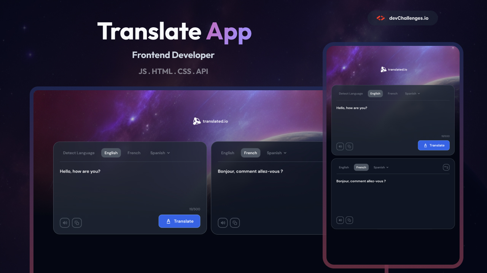

# 🌐 Language Translator



## 🎯 Live Demo
🔗 [View Live Demo](https://your-translator-app.vercel.app/)  
📦 [GitHub Repository](https://github.com/Vladimir-Sag/language-translator)

---

## 📝 Project Overview

A modern, accessible language translation application that allows users to translate text between multiple languages with real-time feedback. Built with React, it features text-to-speech functionality, copy-to-clipboard support, and a clean, responsive interface. The app fetches translations from a public API and provides a seamless user experience for multilingual communication.

**This project was completed as part of the [devChallenges.io](https://devchallenges.io/) frontend challenge.**

---

## ✨ Features

### Core Functionality
- ✅ Translate text between 6+ languages (English, French, Spanish, German, Italian, etc.)
- ✅ Language auto-detection support
- ✅ Swap source and target languages with one click
- ✅ Real-time translation with debounced input (500ms delay)
- ✅ Text-to-speech for both source and translated text
- ✅ Copy to clipboard functionality with visual feedback
- ✅ Character counter with 500-character limit
- ✅ Read-only translation output field

### Accessibility & UX
- ✅ Full keyboard navigation support
- ✅ ARIA labels for screen readers
- ✅ Visual feedback for active language selection
- ✅ Disabled state for duplicate language selection
- ✅ Toast notifications for copy and error states
- ✅ Responsive design (mobile → desktop)
- ✅ Dark theme optimized with CSS variables

### Technical Features
- ✅ AbortController for request cancellation
- ✅ Debounced input to reduce API calls
- ✅ Error handling with user-friendly messages
- ✅ Loading states during translation
- ✅ Custom hooks for speech synthesis and clipboard
- ✅ Modular component architecture

---

## 🛠 Technologies Used

| Category | Technologies |
|----------|--------------|
| **Frontend** | React 19 |
| **Build Tool** | Vite |
| **Styling** | CSS (Flexbox, Grid, CSS Variables, Media Queries) |
| **State Management** | React Hooks (useState, useEffect, useRef) |
| **Data Fetching** | Fetch API with AbortController |
| **Speech Synthesis** | Web Speech API |
| **Clipboard API** | navigator.clipboard |
| **Deployment** | Vercel |

---

## 📡 API Reference

Translation data is fetched from **MyMemory Translation API**:

```http
GET https://api.mymemory.translated.net/get?q={text}&langpair={source}|{target}